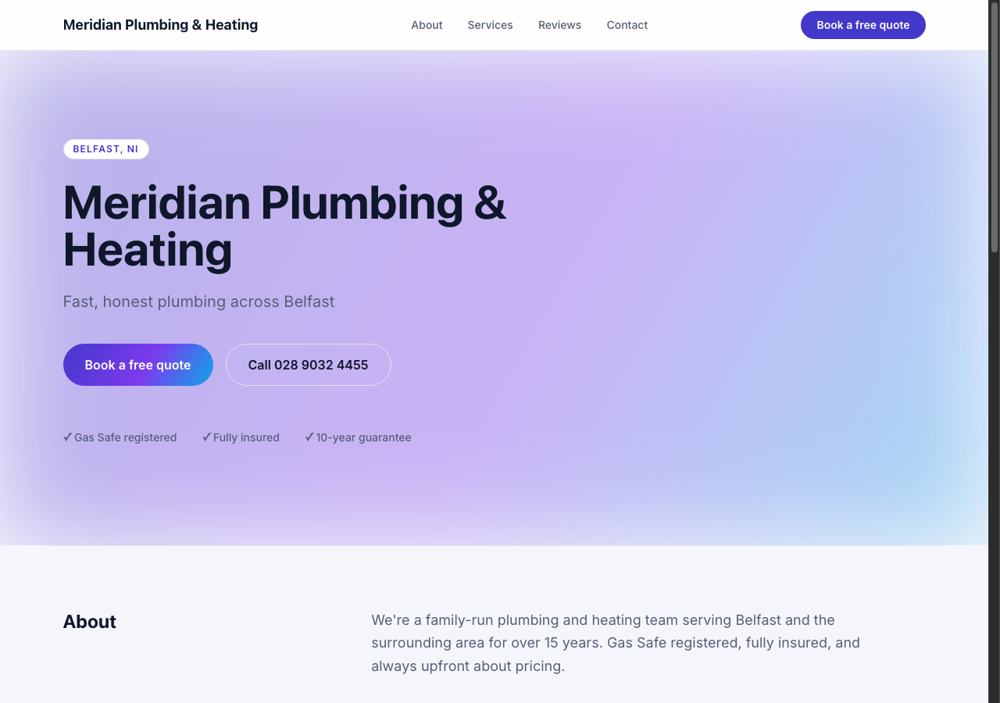
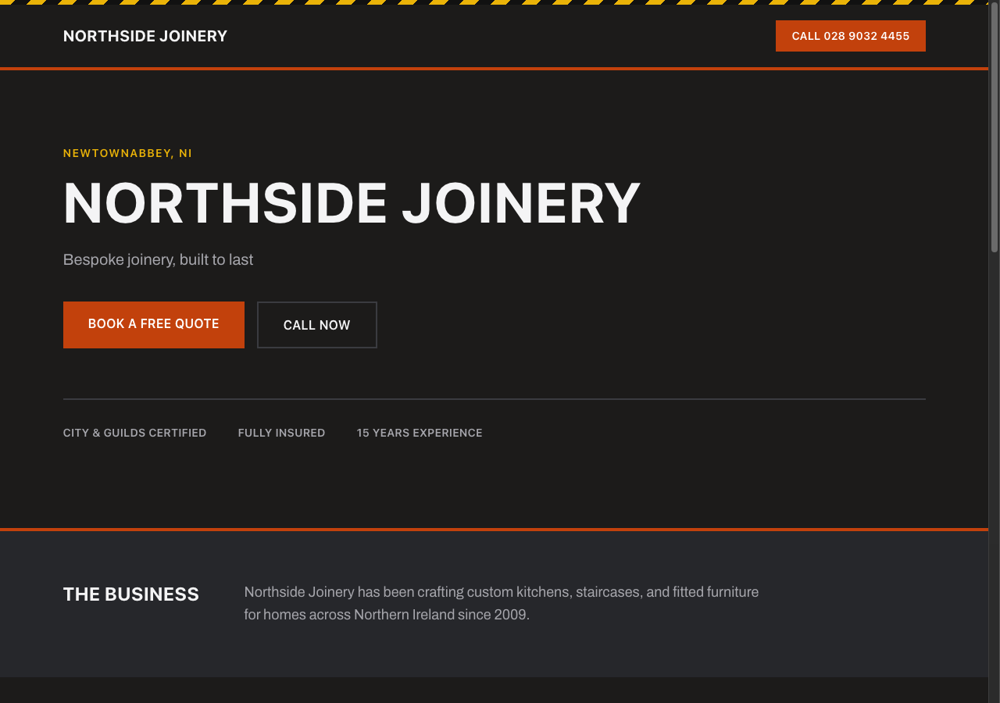
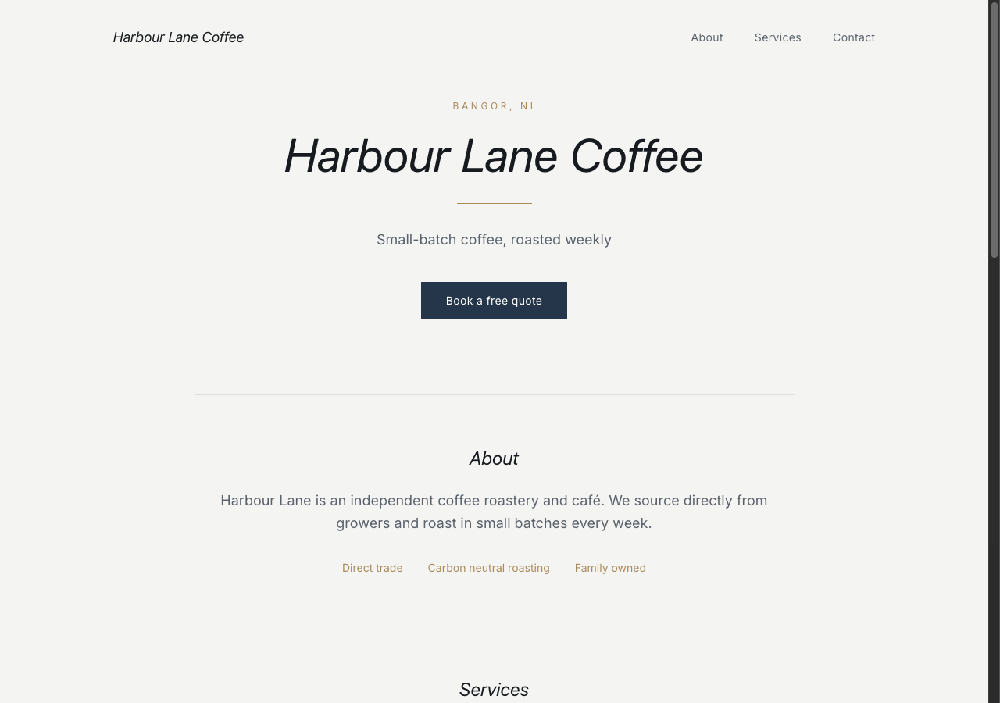

# Launchly

A self-serve website builder for local businesses. Sign up, pick a design, fill in your content — and your site is live at `yourbusiness.launchly.ltd` immediately. No approval queue, no manual publish step, no admin sending you a payment link.

## How it works

1. A business owner signs up with email + password — no card required.
2. They pick a design and fill in their content in the builder wizard.
3. The site publishes immediately at `slug.launchly.ltd` — no review step.
4. A 14-day free trial starts automatically; upgrading is a button in the dashboard, not an email from Adam.
5. Visitors submit the contact form — the lead is saved and emailed to the business.
6. The business can edit content, appearance, or switch designs any time from their dashboard.

## Designs

Four site designs ship out of the box, each with its own layout and palette options. A business can switch between them any time without losing their content.

| Aurora | Foundry |
|---|---|
|  |  |

| Meridian | Bloom |
|---|---|
|  |  |

## What's built in

- Self-serve Stripe billing (Starter and Pro plans) — no manual invoicing
- Contact form leads, saved and emailed to the business automatically
- Editable subdomain with automatic 301 redirect from the old address
- Per-site announcement banners, gallery, testimonials, hours, and socials
- A read-mostly superadmin view for cross-account visibility and an emergency unpublish/delete backstop — nothing in the customer-facing flow depends on it

## Stack

Go (single binary, standard library HTTP server), Supabase (Postgres + Auth), server-rendered `html/template` with Tailwind (no frontend build step), Stripe, Resend for transactional email, deployed on Railway.

## Project structure

```
cmd/server/main.go        — entry point: config, wiring, routing, middleware
internal/
  config/                  — typed env var loading
  domain/                  — pure types shared across layers
  supabase/                — Supabase Auth REST client + local JWT verification
  repository/postgres/     — data access, one file per aggregate; migrations/
  service/                 — business logic: accounts, sites, billing, leads, analytics, cron
  email/                   — Resend client + templated app emails
  payment/                 — Stripe Checkout + webhook handling
  web/                     — HTTP layer: handlers, router, template renderer
web/
  templates/               — public, auth, dashboard, superadmin, and site designs
  static/
```

Each layer only calls the layer below it: `web` → `service` → `repository`/`supabase`/`email`/`payment`.

## Deployment

Runs on Railway. Set these as env vars in the Railway dashboard (see `internal/config` for the full list): `DATABASE_URL`, `DOMAIN`, `SUPABASE_URL`, `SUPABASE_ANON_KEY`, `SUPABASE_SERVICE_ROLE_KEY`, `SUPABASE_JWT_SECRET`, `STRIPE_SECRET_KEY`, `STRIPE_WEBHOOK_SECRET`, `STRIPE_STARTER_PRICE_ID`, `STRIPE_PRO_PRICE_ID`, `RESEND_API_KEY`, `EMAIL_FROM`, `SUPERADMIN_PASSWORD`, `COOKIE_SIGNING_KEY`.

Migrations apply automatically on startup — there's no separate migration command to run.
